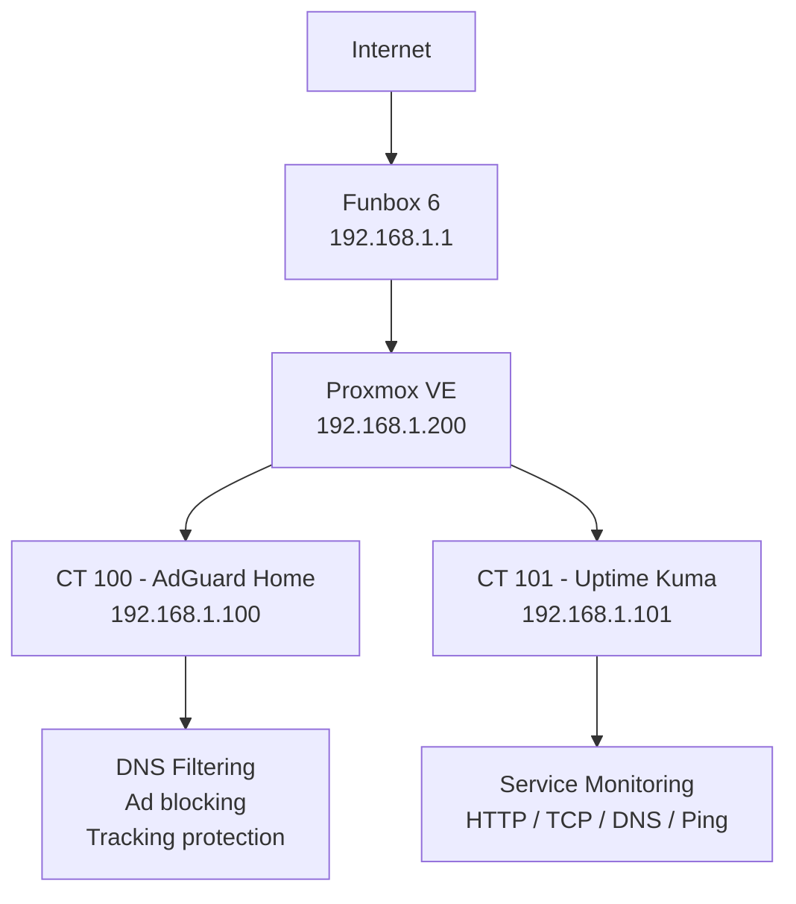

# Proxmox Home Infrastructure Lab

## Opis projektu

Ten projekt przedstawia mały, praktyczny homelab zbudowany na fizycznym komputerze Dell OptiPlex 3040 SFF. Celem było stworzenie lekkiej, użytecznej infrastruktury domowej, która nie jest tylko „testową instalacją”, ale realnie poprawia działanie sieci i pozwala ćwiczyć administrację systemami, wirtualizację, DNS oraz monitoring usług.

Na serwerze został zainstalowany Proxmox VE, który pełni rolę głównej platformy wirtualizacyjnej. W osobnych kontenerach LXC uruchomione zostały usługi odpowiedzialne za filtrowanie DNS oraz monitoring dostępności infrastruktury.

Projekt jest pierwszym etapem większego homelabu, który może być dalej rozwijany o kolejne usługi, takie jak własny serwer plików, VPN, reverse proxy, Wazuh SIEM, OPNsense, Home Assistant lub środowiska testowe Linux/Windows.

---

## Sprzęt

| Komponent     | Wartość                |
| ------------- | ---------------------- |
| Serwer        | Dell OptiPlex 3040 SFF |
| Procesor      | Intel Core i5          |
| RAM           | 8 GB                   |
| Dysk          | SSD 500 GB             |
| Platforma     | Proxmox VE             |
| Router domowy | Funbox 6               |
| Sieć lokalna  | 192.168.1.0/24         |

Sprzęt został dobrany jako budżetowa platforma do nauki self-hostingu i administracji. Dell OptiPlex 3040 SFF jest wystarczająco wydajny do uruchamiania lekkich kontenerów LXC, usług sieciowych oraz podstawowych narzędzi monitorujących.

---

## Architektura

---

## Usługi uruchomione w projekcie

| Usługa       | Technologia           | Rola                                                       |
| ------------ | --------------------- | ---------------------------------------------------------- |
| Proxmox VE   | Bare-metal hypervisor | Zarządzanie kontenerami i przyszłymi maszynami wirtualnymi |
| AdGuard Home | LXC / Debian          | Lokalny DNS, blokowanie reklam i trackerów                 |
| Uptime Kuma  | LXC + Docker          | Monitoring dostępności usług                               |
| Docker       | Debian LXC            | Uruchamianie aplikacji kontenerowych                       |
| Funbox 6     | Router ISP            | Brama sieci domowej                                        |

---

## AdGuard Home

AdGuard Home został wdrożony jako osobny kontener LXC. Jego zadaniem jest obsługa zapytań DNS w sieci lokalnej oraz blokowanie domen reklamowych, trackingowych i telemetrycznych.

### Główne funkcje

* filtrowanie DNS dla urządzeń w sieci lokalnej,
* blokowanie reklam i trackerów,
* analiza zapytań DNS,
* statystyki najczęściej odpytywanych domen,
* możliwość tworzenia lokalnych wpisów DNS,
* centralne zarządzanie regułami filtrowania.

### Przykładowa konfiguracja

| Parametr    | Wartość                                |
| ----------- | -------------------------------------- |
| Kontener    | CT 100                                 |
| System      | Debian LXC                             |
| Adres IP    | 192.168.1.100                          |
| Port panelu | 80/TCP                                 |
| Port DNS    | 53/TCP, 53/UDP                         |
| Tryb pracy  | Lokalny resolver DNS dla sieci domowej |

### Przykładowe lokalne nazwy DNS

| Nazwa        | Adres         |
| ------------ | ------------- |
| adguard.home | 192.168.1.100 |
| proxmox.home | 192.168.1.200 |
| router.home  | 192.168.1.1   |
| uptime.home  | 192.168.1.101 |

Dzięki temu zamiast pamiętać adresy IP, można korzystać z czytelnych nazw lokalnych.

---

## Uptime Kuma

Uptime Kuma został uruchomiony w osobnym kontenerze LXC z Dockerem. Jego zadaniem jest monitorowanie, czy podstawowe elementy homelabu działają poprawnie.

### Monitorowane elementy

| Monitor             | Typ      | Cel                                                 |
| ------------------- | -------- | --------------------------------------------------- |
| AdGuard Home Panel  | HTTP     | Sprawdzenie dostępności panelu AdGuard              |
| AdGuard DNS TCP 53  | TCP Port | Sprawdzenie, czy usługa DNS nasłuchuje na porcie 53 |
| AdGuard DNS Resolve | DNS      | Test rozwiązywania domen przez AdGuard              |
| Proxmox Web UI      | HTTPS    | Sprawdzenie dostępności panelu Proxmox              |
| Funbox 6            | Ping     | Sprawdzenie dostępności routera                     |
| Internet Cloudflare | Ping     | Test łączności z internetem                         |
| Internet Quad9      | Ping     | Drugi niezależny test łączności                     |

## Zastosowane podejście

W projekcie przyjęto kilka prostych zasad:

1. Każda ważna usługa działa w osobnym kontenerze.
2. AdGuard Home i Uptime Kuma nie są zainstalowane bezpośrednio na hoście Proxmox.
3. Kontenery mają statyczne adresy IP.
4. Usługi krytyczne są uruchamiane automatycznie po starcie serwera.
5. Konfiguracja usług jest możliwa do backupu i łatwego odtworzenia.
6. Paneli administracyjnych nie wystawiono bezpośrednio do internetu.

Takie podejście ułatwia utrzymanie środowiska, testowanie nowych usług i bezpieczną rozbudowę homelabu.

---

## Dlaczego Proxmox?

Proxmox VE został wybrany, ponieważ dobrze nadaje się do małego domowego serwera. Pozwala uruchamiać lekkie kontenery LXC oraz pełne maszyny wirtualne, a jednocześnie daje wygodny panel administracyjny.

W tym projekcie Proxmox pozwala na:

* izolowanie usług w osobnych kontenerach,
* szybkie tworzenie backupów,
* testowanie nowych usług bez ryzyka dla głównego systemu,
* wygodne zarządzanie zasobami CPU, RAM i dyskiem,
* dalszą rozbudowę środowiska o kolejne VM lub kontenery.

---

## Umiejętności pokazane w projekcie

Projekt pokazuje praktyczne podstawy administracji i utrzymania infrastruktury IT:

* instalacja i podstawowa konfiguracja Proxmox VE i innych podobnych narzędzi do wirtualizacji takich jak VMware ESXI,
* tworzenie i zarządzanie kontenerami LXC,
* konfiguracja statycznej adresacji IP,
* wdrożenie lokalnego serwera DNS,
* filtrowanie ruchu DNS za pomocą AdGuard Home,
* uruchomienie aplikacji w Dockerze,
* konfiguracja monitoringu dostępności usług,
* testowanie działania HTTP, TCP, DNS i ICMP,
* podstawowa segmentacja usług,
* backup i odtwarzanie kontenerów,
* dokumentowanie infrastruktury w formie czytelnej dla innych.

---

**Technologie:** Proxmox VE, LXC, Debian, Docker, AdGuard Home, Uptime Kuma, DNS, TCP/IP, Linux, Homelab, Monitoring.

---

## Zakres i bezpieczeństwo

Projekt działa wyłącznie w sieci lokalnej. Panele administracyjne Proxmox, AdGuard Home i Uptime Kuma nie są wystawione publicznie do internetu. Konfiguracja została przygotowana do celów edukacyjnych, administracyjnych i laboratoryjnych.

## Status projektu

Projekt jest aktywny i stanowi bazę pod dalszą rozbudowę domowej infrastruktury IT oraz portfolio z zakresu administracji systemami, sieci i cyberbezpieczeństwa.
