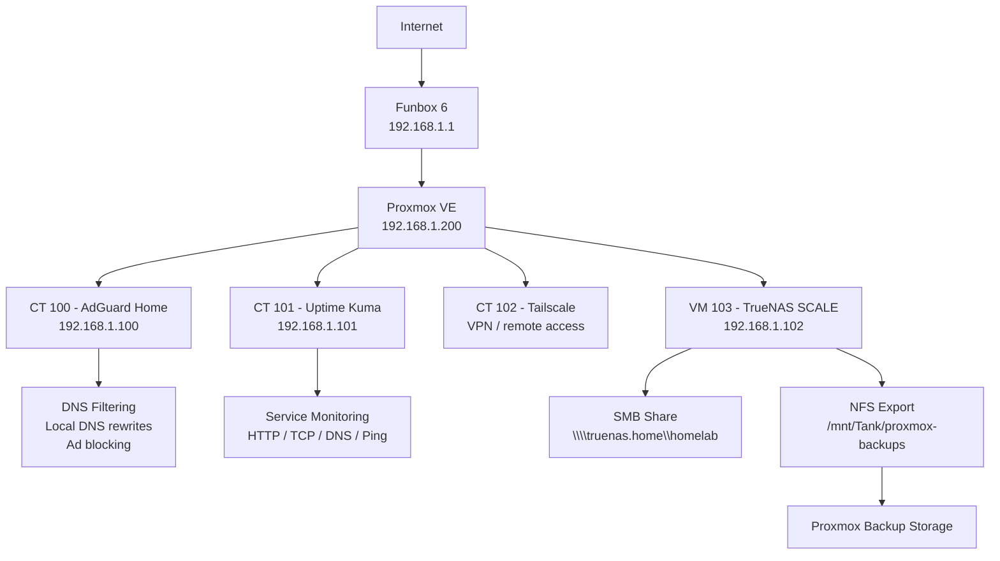

# Proxmox Home Infrastructure Lab


## Opis projektu

Ten projekt przedstawia mały, praktyczny homelab zbudowany na fizycznym komputerze Dell OptiPlex 3040 SFF. Celem było stworzenie lekkiej, użytecznej infrastruktury domowej, która nie jest tylko „testową instalacją”, ale realnie poprawia działanie sieci i pozwala ćwiczyć administrację systemami, wirtualizację, DNS, monitoring usług oraz podstawy zarządzania sieciowym magazynem danych.

Na serwerze został zainstalowany Proxmox VE, który pełni rolę głównej platformy wirtualizacyjnej. W osobnych kontenerach LXC uruchomione zostały usługi odpowiedzialne za filtrowanie DNS oraz monitoring dostępności infrastruktury. Dodatkowo wdrożono maszynę wirtualną TrueNAS SCALE, która pełni rolę laboratoryjnego serwera plików oraz miejsca na testowe backupy środowiska Proxmox.

Projekt jest bazą większego homelabu, który może być dalej rozwijany o kolejne usługi, takie jak VPN, reverse proxy, Wazuh SIEM, OPNsense, Home Assistant, automatyczne backupy, środowiska testowe Linux/Windows oraz bardziej rozbudowany NAS z osobnymi dyskami.

---

## Sprzęt

| Komponent     | Wartość                |
| ------------- | ---------------------- |
| Serwer        | Dell OptiPlex 3040 SFF |
| Procesor      | Intel Core i5          |
| RAM           | 8 GB                   |
| Dysk          | SSD 500 GB             |
| Platforma     | Proxmox VE             |
| Router domowy | Funbox 6               |
| Sieć lokalna  | 192.168.1.0/24         |

Sprzęt został dobrany jako budżetowa platforma do nauki self-hostingu i administracji. Dell OptiPlex 3040 SFF jest wystarczająco wydajny do uruchamiania lekkich kontenerów LXC, usług sieciowych, podstawowego monitoringu oraz testowej maszyny TrueNAS SCALE.

Obecna konfiguracja TrueNAS ma charakter laboratoryjny. Ze względu na ograniczoną ilość pamięci RAM oraz pojedynczy fizyczny dysk hosta nie jest to jeszcze docelowy, produkcyjny NAS dla krytycznych danych. Projekt pokazuje jednak poprawny kierunek rozbudowy: osobne dyski pod dane, ZFS, udziały SMB/NFS, snapshoty i backupy.

---

## Architektura



---

## Usługi uruchomione w projekcie

| Usługa       | Technologia           | Rola                                                       |
| ------------ | --------------------- | ---------------------------------------------------------- |
| Proxmox VE   | Bare-metal hypervisor | Zarządzanie kontenerami LXC i maszynami wirtualnymi        |
| AdGuard Home | LXC / Debian          | Lokalny DNS, blokowanie reklam i trackerów                 |
| Uptime Kuma  | LXC + Docker          | Monitoring dostępności usług                               |
| Tailscale    | LXC / Linux           | Bezpieczny zdalny dostęp do wybranych usług homelabu       |
| TrueNAS SCALE| VM / Linux / ZFS      | NAS, udziały SMB/NFS, snapshoty, testowe backupy Proxmoxa  |
| Docker       | Debian LXC            | Uruchamianie aplikacji kontenerowych                       |
| Funbox 6     | Router ISP            | Brama sieci domowej                                        |

---

## AdGuard Home

AdGuard Home został wdrożony jako osobny kontener LXC. Jego zadaniem jest obsługa zapytań DNS w sieci lokalnej oraz blokowanie domen reklamowych, trackingowych i telemetrycznych.

### Główne funkcje

* filtrowanie DNS dla urządzeń w sieci lokalnej,
* blokowanie reklam i trackerów,
* analiza zapytań DNS,
* statystyki najczęściej odpytywanych domen,
* możliwość tworzenia lokalnych wpisów DNS,
* centralne zarządzanie regułami filtrowania.

### Przykładowa konfiguracja

| Parametr    | Wartość                                |
| ----------- | -------------------------------------- |
| Kontener    | CT 100                                 |
| System      | Debian LXC                             |
| Adres IP    | 192.168.1.100                          |
| Port panelu | 80/TCP                                 |
| Port DNS    | 53/TCP, 53/UDP                         |
| Tryb pracy  | Lokalny resolver DNS dla sieci domowej |

### Lokalne nazwy DNS

| Nazwa         | Adres         | Rola                         |
| ------------- | ------------- | ---------------------------- |
| adguard.home  | 192.168.1.100 | Panel AdGuard Home           |
| uptime.home   | 192.168.1.101 | Panel Uptime Kuma            |
| truenas.home  | 192.168.1.102 | Panel TrueNAS i udział SMB   |
| proxmox.home  | 192.168.1.200 | Panel Proxmox VE             |
| router.home   | 192.168.1.1   | Router Funbox 6              |

Dzięki lokalnym wpisom DNS nie trzeba pamiętać adresów IP usług. Przykładowo panel TrueNAS może być dostępny jako `https://truenas.home`, a udział plików jako `\\truenas.home\homelab`.

---

## TrueNAS SCALE

TrueNAS SCALE został wdrożony jako maszyna wirtualna w Proxmox VE. Jego zadaniem jest pełnienie roli laboratoryjnego NAS-a, czyli centralnego miejsca na pliki, testowe backupy oraz ćwiczenie zarządzania storage w środowisku domowym.

### Rola TrueNAS w homelabie

* udostępnianie plików w sieci lokalnej przez SMB,
* udostępnianie przestrzeni backupowej dla Proxmoxa przez NFS,
* nauka zarządzania datasetami i uprawnieniami,
* testowanie snapshotów ZFS,
* integracja z lokalnym DNS w AdGuard Home,
* monitoring dostępności usług NAS w Uptime Kuma.

### Przykładowa konfiguracja VM

| Parametr      | Wartość                         |
| ------------- | ------------------------------- |
| Maszyna       | VM 103                          |
| System        | TrueNAS SCALE                   |
| Adres IP      | 192.168.1.102                   |
| DNS           | 192.168.1.100, czyli AdGuard    |
| Pool          | Tank                            |
| Udział SMB    | `homelab`                       |
| Export NFS    | `/mnt/Tank/proxmox-backups`     |
| Lokalna nazwa | `truenas.home`                  |

### Struktura danych

Przykładowa struktura datasetów:

```text
Tank/
├── homelab
├── proxmox-backups
├── documents
└── media
```

Dataset `homelab` służy jako podstawowy udział sieciowy dla komputerów w LAN. Dataset `proxmox-backups` jest używany jako miejsce na testowe kopie zapasowe kontenerów i maszyn wirtualnych z Proxmoxa.

### SMB

Udział SMB pozwala korzystać z TrueNAS jako prostego dysku sieciowego w Windows.

Przykładowa ścieżka:

```text
\\192.168.1.102\homelab
```

Po skonfigurowaniu lokalnego DNS:

```text
\\truenas.home\homelab
```

Dostęp do udziału jest realizowany przez użytkownika lokalnego TrueNAS z włączonym dostępem SMB. Uprawnienia datasetu są ustawione tak, aby użytkownik mógł tworzyć katalogi, kopiować pliki i zarządzać zawartością udziału.


### Snapshoty

TrueNAS umożliwia tworzenie snapshotów datasetów. W projekcie można wykorzystać je do ochrony przed przypadkowym usunięciem lub nadpisaniem plików.

Przykładowe zadanie snapshotów:

| Dataset        | Harmonogram | Retencja  |
| -------------- | ----------- | --------- |
| `Tank/homelab` | codziennie  | 2 tygodnie |

Snapshoty nie zastępują backupu, ale są bardzo przydatne jako szybka warstwa ochrony danych.

---

## Uptime Kuma

Uptime Kuma został uruchomiony w osobnym kontenerze LXC z Dockerem. Jego zadaniem jest monitorowanie, czy podstawowe elementy homelabu działają poprawnie.

### Monitorowane elementy

| Monitor             | Typ      | Cel                                                 |
| ------------------- | -------- | --------------------------------------------------- |
| AdGuard Home Panel  | HTTP     | Sprawdzenie dostępności panelu AdGuard              |
| AdGuard DNS TCP 53  | TCP Port | Sprawdzenie, czy usługa DNS nasłuchuje na porcie 53 |
| AdGuard DNS Resolve | DNS      | Test rozwiązywania domen przez AdGuard              |
| Proxmox Web UI      | HTTPS    | Sprawdzenie dostępności panelu Proxmox              |
| TrueNAS Web UI      | HTTPS    | Sprawdzenie dostępności panelu TrueNAS              |
| TrueNAS SMB         | TCP 445  | Sprawdzenie dostępności udziałów SMB                |
| TrueNAS NFS         | TCP 2049 | Sprawdzenie dostępności usługi NFS                  |
| TrueNAS Ping        | Ping     | Sprawdzenie dostępności VM TrueNAS                  |
| Funbox 6            | Ping     | Sprawdzenie dostępności routera                     |
| Internet Cloudflare | Ping     | Test łączności z internetem                         |
| Internet Quad9      | Ping     | Drugi niezależny test łączności                     |

Monitoring pozwala szybko odróżnić problem z DNS, usługą webową, udziałem SMB/NFS, hostem Proxmox, routerem lub samym połączeniem internetowym.

---

## Zastosowane podejście

W projekcie przyjęto kilka prostych zasad:

1. Każda ważna usługa działa w osobnym kontenerze LXC albo maszynie wirtualnej.
2. AdGuard Home, Uptime Kuma i TrueNAS nie są zainstalowane bezpośrednio na hoście Proxmox.
3. Usługi mają statyczne adresy IP.
4. Lokalne nazwy usług są obsługiwane przez AdGuard Home.
5. Usługi krytyczne są uruchamiane automatycznie po starcie serwera.
6. Dostępność usług jest monitorowana w Uptime Kuma.
7. Konfiguracja usług jest możliwa do backupu i łatwego odtworzenia.
8. Paneli administracyjnych nie wystawiono bezpośrednio do internetu.
9. TrueNAS jest wykorzystywany jako etap nauki NAS, SMB, NFS, ZFS i backupów.

Takie podejście ułatwia utrzymanie środowiska, testowanie nowych usług i bezpieczną rozbudowę homelabu.

---

## Dlaczego Proxmox?

Proxmox VE został wybrany, ponieważ dobrze nadaje się do małego domowego serwera. Pozwala uruchamiać lekkie kontenery LXC oraz pełne maszyny wirtualne, a jednocześnie daje wygodny panel administracyjny.

W tym projekcie Proxmox pozwala na:

* izolowanie usług w osobnych kontenerach i VM,
* szybkie tworzenie backupów,
* testowanie nowych usług bez ryzyka dla głównego systemu,
* wygodne zarządzanie zasobami CPU, RAM i dyskiem,
* uruchomienie TrueNAS SCALE jako osobnej maszyny wirtualnej,
* dalszą rozbudowę środowiska o kolejne usługi.

---

## Problemy rozwiązane podczas wdrożenia

Podczas konfiguracji TrueNAS pojawiło się kilka typowych problemów, które zostały rozwiązane:

| Problem | Przyczyna | Rozwiązanie |
| ------- | --------- | ----------- |
| Duplicate serial numbers | Dyski VM nie miały unikalnych seriali | Dodanie unikalnych numerów seryjnych dysków w konfiguracji VM Proxmox |
| Brak dostępu do `truenas.home` | Komputer nie korzystał z AdGuard jako DNS | Dodanie DNS rewrite i weryfikacja ustawień DNS klienta |
| NFS permission denied | Proxmox nie miał praw zapisu do exportu NFS | Korekta uprawnień datasetu i mapowania użytkownika NFS |
| SMB access denied | Użytkownik SMB nie był właścicielem datasetu | Nadanie uprawnień użytkownikowi lokalnemu TrueNAS |

Ta część projektu pokazuje praktyczne debugowanie problemów z DNS, SMB, NFS, uprawnieniami i wirtualizowanym storage.

---

## Umiejętności przetestowane w projekcie

* instalacja i podstawowa konfiguracja Proxmox VE,
* tworzenie i zarządzanie kontenerami LXC,
* tworzenie i konfiguracja maszyn wirtualnych,
* konfiguracja statycznej adresacji IP,
* wdrożenie lokalnego serwera DNS,
* filtrowanie ruchu DNS za pomocą AdGuard Home,
* tworzenie lokalnych wpisów DNS,
* uruchomienie aplikacji w Dockerze,
* konfiguracja monitoringu dostępności usług,
* testowanie działania HTTP, HTTPS, TCP, DNS i ICMP,
* wdrożenie TrueNAS SCALE jako laboratoryjnego NAS,
* konfiguracja udziałów SMB dla klientów Windows,
* konfiguracja NFS jako storage dla backupów Proxmoxa,
* podstawy zarządzania datasetami i uprawnieniami,
* podstawy snapshotów ZFS,
* backup i odtwarzanie kontenerów,
* rozwiązywanie problemów z uprawnieniami i dostępem sieciowym,
* dokumentowanie infrastruktury w formie czytelnej dla innych.

---

## Zakres i bezpieczeństwo

Projekt działa wyłącznie w sieci lokalnej. Panele administracyjne Proxmox, AdGuard Home, Uptime Kuma i TrueNAS nie są wystawione publicznie do internetu. Konfiguracja została przygotowana do celów edukacyjnych, administracyjnych i laboratoryjnych.

W repozytorium nie należy umieszczać:

* haseł,
* tokenów,
* prywatnych kluczy,
* pełnych logów zawierających prywatne domeny lub dane domowników,
* publicznego adresu IP,
* zrzutów ekranu z wrażliwymi danymi.

---

## Status projektu

Projekt jest aktywny i stanowi bazę pod dalszą rozbudowę domowej infrastruktury IT oraz portfolio z zakresu administracji systemami, sieci i cyberbezpieczeństwa.
